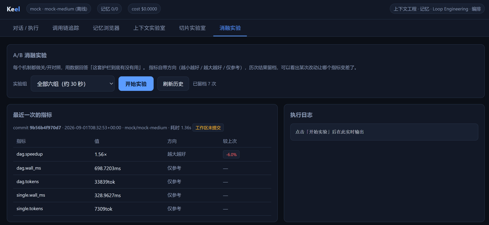

# Keel-Agent-Lab

Keel Agent Lab是一个 Agent 运行时，以及一套用来量化 harness 层改动的对照评测链路。

公开榜单测的是模型能力，换模型分数会动；而给 harness 加一层护栏、换一种切片策略、调整预算分配，分数往往一分不掉，因为它不测过程有多浪费。Keel 把每个机制做成可开关的，在离线确定性 Provider 下做 A/B 对照，使组间差异可以归因到改动本身。六组消融实验由 CI 自动生成，并在每个 PR 上与基线逐项比对，指标退化即阻断合并。



## 一、结构

被测对象是一个完整的 Agent 运行时，五个模块均可独立开关。上下文工程负责分层切片、Token 预算调度与压缩；记忆系统分四层，用向量、BM25、时间新鲜度、重要性四路信号混合检索；Loop Engineering 提供预算护栏、死循环检测、熔断与反思重规划；编排层用 DAG 做分层并发；工具层提供 AST 白名单沙箱与目录穿越防护。

一条请求依次经过护栏检查、记忆召回、上下文组装、模型决策、动作拦截、工具执行、进展评估与收敛判定。

```
keel/
  config.py        集中式配置，护栏阈值与预算参数
  llm/             Provider 抽象，Mock 离线实现，OpenAI 兼容实现
  context/         chunker, budget, compressor, assembler
  memory/          四层记忆与混合检索，遗忘曲线，反思固化
  loop/            state, policy, reflection, engine
  orchestrator/    graph, roles, supervisor
  tools/           Schema 校验，超时重试，熔断器，AST 沙箱
  observability/   Span 树与成本核算，SSE 事件总线
  server/          FastAPI，static 为前端构建产物
web/               控制台源码，React 与 TypeScript
scripts/           demo, bench, report, bench_compare, smoke_api
tests/             114 个测试，全部离线
```

## 二、怎么用

默认跑在离线 Mock Provider 上，不需要任何 API Key。

```bash
conda activate myenv
pip install -r requirements.txt

python scripts/demo.py all      # 五个场景，约 10 秒
python scripts/bench.py all     # 六组 A/B 消融实验，约 30 秒
pytest -q                       # 114 个测试
python -m uvicorn keel.server.app:app --reload   # 控制台 http://127.0.0.1:8000
python scripts/smoke_api.py     # 服务起来后跑，38 项 HTTP 与 SSE 检查
```

前端构建产物已提交进仓库，所以上述命令不需要安装 Node。只有修改界面时才需要在 web 目录下执行 npm ci 与 npm run dev，改完用 npm run build 把产物写回并一并提交。容器方式为 docker compose up --build。

接入真实模型时复制 .env.example 为 .env，填入 KEEL_PROVIDER、KEEL_MODEL、KEEL_API_KEY 与 KEEL_BASE_URL。一份 OpenAI 兼容实现同时覆盖 OpenAI、DeepSeek、通义千问、Kimi、vLLM 与 Ollama。

## 三、用法示例

护栏 A/B 对照。两组硬上限完全相同，差别只有动作重复检测、周期振荡检测、进展停滞检测与反思重规划的开关，因此省下的 token 可以归因到检测器本身。

| 分组 | 步数 | tokens | 重复调用 | 有答案 |
|---|---|---|---|---|
| 正常任务 8 个，护栏关闭 | 2.4 | 3366 | 0.0 | 8/8 |
| 正常任务 8 个，护栏开启 | 2.4 | 3358 | 0.0 | 8/8 |
| 病态任务 4 个，护栏关闭 | 30.0 | 61070 | 28.0 | 4/4 |
| 病态任务 4 个，护栏开启 | 4.0 | 6194 | 3.0 | 4/4 |

病态任务上步数下降 86.7%，token 下降 89.9%，且被中止后仍产出降级答案而不是抛错。正常任务两组逐项一致，说明护栏没有误杀，这一行与那些百分比同样重要。

另外两组的结论：工具熔断在同样 12 次调用意图下，把落到下游的真实请求从 24 次压到 6 次；DAG 编排的内部并发加速比为 1.6 倍，但端到端墙钟反而更慢、token 贵数倍，说明这个规模的任务不该编排。

完整六组实验与解读由 scripts/bench.py 生成并发布到 GitHub Pages，不是手抄的数字。

## 四、为什么做这个项目

harness 层的工程决策长期缺少判据。护栏有没有减少无效调用、死循环在第几步止损、超窗率降了多少，这些问题公开榜单回答不了，因为它标注的是最终答案对不对，而不是过程有多浪费。所以这里做的是 ablation study，不是 capability benchmark。

用离线 Mock 而不是真实模型，是为了消除模型方差。Mock 由规则驱动、不含随机数，A/B 两组的差异可以完全归因到 harness 改动。代价是病态任务依赖 Mock 的确定性触发词，真实模型下无法复现同一条曲线，这是本项目的局限而不是特性。

写评测的最大收益不是那些百分比，而是它逼着每个开关都被真的拨动一次，因此抓出四个 bug：cycle_detect_window 设为 0 关不掉周期检测，因为 fps[-0:] 等价于 fps[0:]；编排模式没有把 tracer 传给子任务，少记了 80% 以上的 token；测试套件不密闭，改一下 .env 就会去打网络请求；embedding 降级静默失效，cosine 在长度不等时直接返回 0.0，检索悄悄退化成纯 BM25。

## 引用

1. Yao et al. ReAct: Synergizing Reasoning and Acting in Language Models. ICLR 2023. arXiv:2210.03629
2. Shinn et al. Reflexion: Language Agents with Verbal Reinforcement Learning. NeurIPS 2023. arXiv:2303.11366
3. Park et al. Generative Agents: Interactive Simulacra of Human Behavior. UIST 2023. arXiv:2304.03442
4. Liu et al. Lost in the Middle: How Language Models Use Long Contexts. TACL 2024. arXiv:2307.03172
5. Carbonell and Goldstein. The Use of MMR, Diversity-Based Reranking for Reordering Documents and Producing Summaries. SIGIR 1998
6. Robertson and Zaragoza. The Probabilistic Relevance Framework: BM25 and Beyond. Foundations and Trends in Information Retrieval, 2009
7. Ebbinghaus. Memory: A Contribution to Experimental Psychology. 1885
8. Nygard. Release It! Design and Deploy Production-Ready Software. Pragmatic Bookshelf, 2007
9. Yao et al. tau-bench: A Benchmark for Tool-Agent-User Interaction in Real-Domain. arXiv:2406.12045
10. OpenTelemetry Tracing Specification. https://opentelemetry.io/docs/specs/otel/trace/api/
